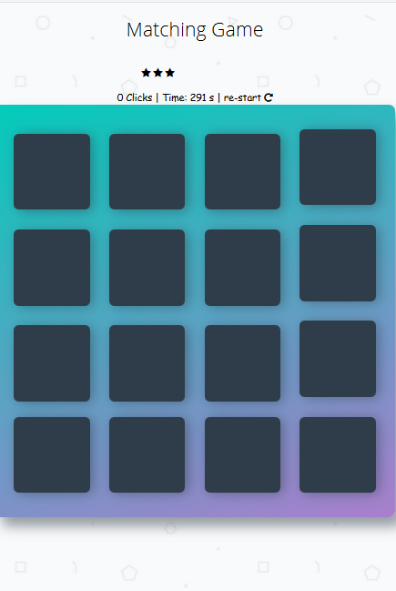

# Memory Game Project

## How to play

* Click on each tile will to see the content beneath the tile.
* Your target is to match two same tile at a time 
* Ensure to match all pairs at the mininum number of moves.
* Enjoy the game.

## ScreenShot

## Click [Memory Game App](https://danrejsa.github.io/Memory-Game/) to play the game.
